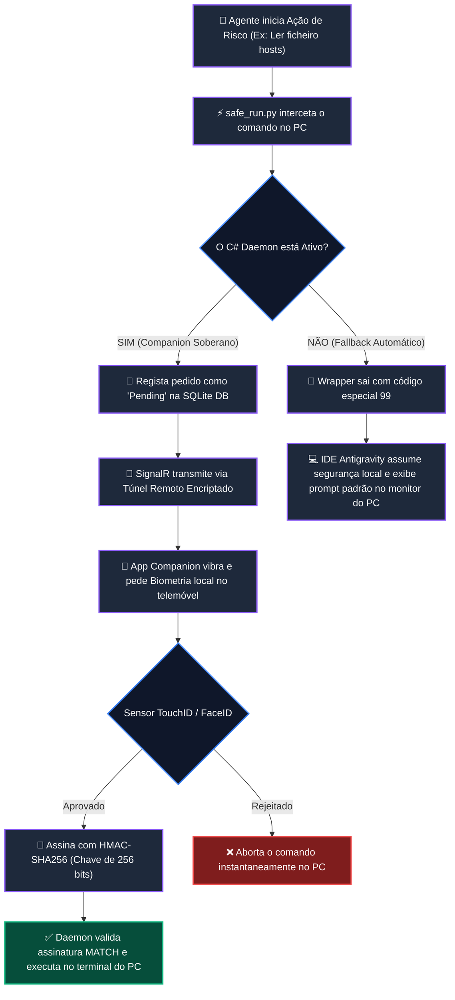

# 🛡️ Antigravity Biometric Companion Gateway
### *Controlo Remoto Soberano, Vibe Coding Móvel e Segurança Criptográfica para Agentes de IA* 📱⚡

[](LICENSE)
[](https://github.com/Kail-the-akuma/antigravity-mobile-companion/pulls)
[](https://dotnet.microsoft.com/download)
[](https://expo.dev/)

**Antigravity Companion** é um **Painel de Controlo Executivo e Cockpit de Vibe Coding Remoto** que liga o teu computador pessoal ao teu telemóvel. Ele permite monitorizar, gerir recursos e aprovar com segurança a execução de tarefas críticas do teu agente de IA autónomo Antigravity, mesmo quando estás longe de casa (via redes móveis 4G/5G).

---

## 📖 Índice
* [💡 O Conceito: Para Todos](#-o-conceito-para-todos)
* [⚙️ O Pipeline de Decisão: Debaixo do Capô](#%EF%B8%8F-o-pipeline-de-decisão-debaixo-do-capô)
* [🎨 Elegância Visual e Feedback em Tempo Real](#-elegância-visual-e-feedback-em-tempo-real)
* [🔒 Pilares Fundamentais de Segurança](#-pilares-fundamentais-de-segurança)
* [🛠️ Requisitos e Configuração Rápida](#%EF%B8%8F-requisitos-e-configuração-rápida)
* [⚡ Desafios Técnicos Resolvidos](#-desafios-técnicos-resolvidos)
* [📄 Licença](#-licença)

---

## 💡 O Conceito: Para Todos

Diferente dos assistentes de chat tradicionais (como o ChatGPT), o **Antigravity** é um **Agente Autónomo**. Isto significa que ele programa de forma independente, edita ficheiros locais no teu PC, cria projetos e executa comandos diretamente no terminal. 

Para evitar o risco de a IA apagar ficheiros confidenciais ou executar scripts perigosos por engano (problema conhecido como *Excessive Agency*), criámos o **Companion Gateway**:

* **💬 Vibe Coding Remoto:** Envia prompts complexos ("Corrige o bug de concorrência", "Cria um painel React") do chat do telemóvel para o PC remoto e assiste à escrita do código em tempo real.
* **👁️ Monitorização de Execução:** Vê instantaneamente quais os comandos que a IA está a correr e os ficheiros que está a alterar, diretamente no teu telemóvel.
* **🛡️ Soberania Biométrica:** Sempre que o agente tenta correr um comando sensível no PC, a execução é congelada e o telemóvel pede a tua **Impressão Digital ou Reconhecimento Facial (TouchID/FaceID)**. Só após a tua validação local é que o PC executa a ação.
* **⚡ Gestão Dinâmica de Recursos:** Altera de modelo (Gemini, Claude, GPT) instantaneamente e controla o teu orçamento de tokens em tempo real.

---

## ⚙️ O Pipeline de Decisão: Debaixo do Capô

Abaixo está o fluxo híbrido autocompensador e encriptado que acontece no ecossistema sempre que uma instrução é executada:



---

## 🎨 Elegância Visual e Feedback em Tempo Real

A experiência do utilizador móvel foi desenhada sobre o conceito de **Transparência Estrita**:

* **🟢 Bandeira de Conexão Pulsante:** Um indicador neon verde-brilhante no topo exibe `"LIGADO AO DAEMON"`, garantindo que o canal encriptado de SignalR está ativo.
* **📊 Cápsulas de Quotas Inteligentes:** O consumo dos LLMs é representado visualmente por **5 blocos horizontais segmentados** que se esvaziam dinamicamente, acompanhados por um sinal de alerta `⚠️` para modelos sem créditos.
* **🎛️ Comutadores Overages:** Um interruptor animado de transição de vidro na app permite-te autorizar orçamentos extras de tokens temporários com um simples deslizar.
* **📝 Mirroring de Prompt do IDE:** Quando o utilizador escreve no IDE do PC, a app mostra uma bolha de chat elegante etiquetada como **"💻 ENVIADO DO IDE"** juntamente com um loader pulsante de **"Agente em Execução (Ambiente Remoto)"**.

---

## 🔒 Pilares Fundamentais de Segurança

1. **Soberania Biométrica HMAC-SHA256:**
   A autenticação não envia uma mensagem simples de "Sim". Ela gera uma chave criptográfica assinada com um segredo privado local gerado durante o emparelhamento inicial. O Daemon C# recalcula o HMAC localmente. O terminal do PC só é desbloqueado com um `MATCH` perfeito.
2. **Mecanismo Fallback Segura (Código 99):**
   Se o Daemon C# estiver offline, o wrapper `safe_run.py` apanha a falha de socket e encerra com código `99`, forçando o IDE do PC a assumir a segurança local, bloqueando o ecrã até que o utilizador valide no teclado físico.
3. **Persistência de Fila (SQLite ACID):**
   Se estiveres sem rede móvel no telemóvel, as aprovações pendentes são empilhadas de forma transacional na SQLite local do PC, surgindo de forma cronológica na app no exato segundo em que recuperares sinal de rede.

---

## 🛠️ Requisitos e Configuração Rápida

### Requisitos:
* **PC:** [.NET SDK 8.0](https://dotnet.microsoft.com/en-us/download/dotnet/8.0) instalado.
* **Telemóvel:** Expo Go instalado (para desenvolvimento) ou builds compilados para Android/iOS.
* **Node.js:** Versão 18 ou superior.

### 🔌 Passo 1: Inicializar o Daemon Backend (C#)
1. Navega para a diretoria do Daemon:
   ```bash
   cd daemon/AntigravityDaemon.Api
   ```
2. Executa o restauro e corre o servidor:
   ```bash
   dotnet run
   ```
   O Daemon irá inicializar-se no porto `5117` e abrirá automaticamente o painel de emparelhamento. Um código **Pairing Pin** dinâmico e o endereço IP local ser-te-ão mostrados no terminal. O **túnel público seguro do localtunnel** também será inicializado automaticamente na rede externa!

### 📱 Passo 2: Executar a Aplicação Móvel (React Native)
1. Navega para a diretoria mobile:
   ```bash
   cd mobile
   ```
2. Instala as dependências:
   ```bash
   npm install
   ```
3. Corre o servidor de desenvolvimento Expo:
   ```bash
   npx expo start
   ```
4. Abre a aplicação no teu telemóvel lendo o código QR gerado no terminal com o **Expo Go** (Android) ou câmara nativa (iOS). Insere o IP e o Pin de emparelhamento exibidos pelo Daemon no PC para sincronizar instantaneamente!

---

## ⚡ Desafios Técnicos Resolvidos

### 1. Deteção e Auto-Cura de Processos Duplicados (Seguro e Local)
Para evitar conflitos de porto (`5117` ocupado) ou processos fantasma de `localtunnel` e `node` a correr em segundo plano, implementámos um sistema de **Dupla Verificação de Inicialização** em [Program.cs](daemon/AntigravityDaemon.Api/Program.cs):
* **HTTP Check:** Faz uma chamada a `/api/pairing/pid` local. Se houver resposta, recolhe o PID exato em execução.
* **PID File Fallback:** Se a porta estiver presa mas inativa (servidor congelado), lê o PID guardado no ficheiro local `antigravity_companion.pid`.
* **Whitelist de Processos:** Valida estatutariamente se o nome do processo alvo contém `"dotnet"` ou `"antigravity"` antes de efetuar qualquer terminação. Isto garante **perfeita segurança de utilizador** (UAC), evitando fechar aplicações de terceiros sem necessidade de privilégios elevados.
* **Árvore Completa:** Executa `p.Kill(entireProcessTree: true)` nativo em .NET para limpar de imediato todos os processos filhos (incluindo o túnel de Node.js).

### 2. Estabilização do Túnel Persistente (Rede Móvel 4G/5G)
Operadoras móveis costumam cortar WebSockets persistentes de longa duração devido a firewalls agressivas. 
* **Resolução:** Configurámos o cliente SignalR móvel com fallback automático para **HTTP LongPolling** sob dados móveis e injetámos cabeçalhos estritos de bypass de proxy (`bypass-tunnel-reminder: true`), permitindo que a conexão permaneça ativa 24/7 de forma rápida e estável.

### 3. Normalização de Timezones e Assinaturas UUID (SQLite Case-Insensitive)
* **Resolução:** O motor SQLite do Windows tende a lidar com strings de UUIDs em maiúsculas enquanto o JavaScript móvel as gera em minúsculas. Implementámos um normalizador de casing insensível a maiúsculas no middleware do Daemon, eliminando falsos-negativos de "Mismatch de Assinatura" criptográfica. Normalizámos também os registos de timezone para `DateTimeKind.Utc` para evitar duplicações silenciosas induzidas por offsets locais (UTC+1).

---

## 📄 Licença

Este projeto está licenciado sob a licença MIT - consulte o ficheiro [LICENSE](LICENSE) para obter mais detalhes.
