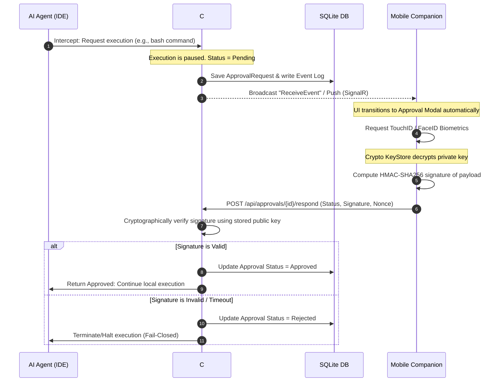

# Antigravity Biometric Companion Gateway
### *Secure Remote Supervision & Cryptographic Human-in-the-Loop Gateway for Autonomous Coding Agents*

---

[](LICENSE)
[](https://dotnet.microsoft.com/download/dotnet/8.0)
[](https://reactnative.dev/)
[](https://en.wikipedia.org/wiki/HMAC)

## 1. Overview
The **Antigravity Biometric Companion Gateway** is a secure, low-latency, mobile-first orchestration gateway designed to solve the critical "human-in-the-loop" problem for autonomous AI coding agents. 

When autonomous agents (e.g., executing commands, writing code, editing system configurations) run on a personal computer or local workspace, they frequently execute hazardous operations (such as running shell scripts or executing unverified database migrations). Traditional terminal-bound confirmation prompts force the user to remain tethered to their workstation.

This project bridges that gap by decoupling execution from approval. By combining a lightweight background daemon, a mobile companion app, and cryptographically signed biometric handshakes, **Antigravity** allows you to safely supervise, review, and authorize agent actions remotely over secure tunnels or local networks.

---

## 2. The Problem: Why Autonomous Agents Need Supervision
Autonomous AI coding agents are highly productive, but they lack operational boundaries and contextual risk awareness. 

1.  **The Context Blindspot**: An agent might attempt to clean a directory using `rm -rf` or install a vulnerable package without evaluating the security implications.
2.  **Continuous Supervision Fatigue**: Forcing developers to watch terminal lines scroll past kills the productivity gains of hiring an AI agent.
3.  **Tethered Friction**: Developers cannot step away from their desk because the agent might halt waiting for local terminal approval.

**Antigravity** turns your smartphone into a secure, out-of-band executive approval console. The agent runs at full speed until it hits a sensitive boundary. At that point, it pauses, securely streams the changeset and planned commands to your mobile device, and waits for a biometrically verified cryptographic signature.

---

## 3. Core Architecture
The system is architected as a decoupled, zero-trust gateway split into three primary entities:

```
[ Local IDE / AI Agent ]  <--->  [ C# Daemon API ]  <=== (SignalR / localtunnel) ===>  [ React Native Mobile Companion ]
                                       |
                              [ SQLite Event Log ]
```

1.  **The PC Daemon (ASP.NET Core 8)**: Spuns up a local Kestrel web host. It monitors agent logs recursively, intercepts risky shell invocations, queues approvals, and manages cryptographic keys for registered devices.
2.  **The Mobile Companion (React Native + Expo)**: A pure presentation and approval layer structured around Domain-Driven Bounded Contexts. It implements local reducers to process incoming event streams deterministically and triggers biometrics for signing execution payloads.
3.  **The Cryptographic Pipe**: The communication layer dynamically handles local LAN IP transitions (DHCP lease renewals) and cellular remote networks (via secure reverse tunnels orchestrated on the fly).

---

## 4. Execution Approval Flow
The gateway enforces a strict, synchronous approval gate. The AI agent cannot execute a marked action without generating a matching cryptographic signature on the mobile device.



---

## 5. Security Model
We operate under a strict **Zero-Trust Network posture**. Because data travels over public reverse-tunnels (`localtunnel`), the intermediate transport layer must be treated as hostile and potentially monitored.

*   **Human Approval Authority**: Cryptographic signatures are generated using public-key cryptography (ECDSA/RSA). Private keys are held strictly in the hardware-backed secure storage of your mobile device (iOS Keychain / Android KeyStore) and decrypted only upon successful biometric authentication (TouchID/FaceID).
*   **Asymmetric Attestation**: The Daemon registers the device's public key during a secure, local-only pairing handshake (LAN or QR Code). Every execution decision sent by the phone is signed using the matching private key, meaning an attacker intercepting the tunnel cannot forge approval.
*   **Replay Attack Countermeasures**: All signatures incorporate a high-resolution UTC timestamp (`X-Timestamp`) and an atomic, single-use cryptographic `nonce` (`X-Nonce`). The Daemon rejects any signatures older than 15 seconds or containing a previously used nonce.
*   **Fail-Closed Architecture**: If the network tunnel is severed, or if the C# Daemon crumbles, the system **degrades safely**. The terminal wrappers fail-closed, blocking the AI agent from silently executing operations.

---

## 6. Mobile Orchestration Capabilities
The mobile client provides comprehensive executive supervision over your autonomous workflows:

*   **Biometric Sign-off**: Review structural diffs and bash commands. Authorize execution with zero-latency face or fingerprint scanning.
*   **Real-Time Execution Logs**: Observe running terminal logs and LLM reasoning steps streamed over secure WebSockets in real time.
*   **Remote Bounded Control**: Manage model quotas, toggle AI credit overages, and monitor real-time credit metrics synced instantly with the Daemon.
*   **Dynamic Connectivity Handshake**: An integrated bidirectional auto-sync engine instantly repairs connection parameters. If your PC's local IP changes (DHCP renewal) or the tunnel regenerates, the system self-heals as soon as one network path succeeds.

---

## 7. Technical Stack
We chose these technologies deliberately, prioritizing structural resilience, speed, and low operational overhead:

### C# Daemon Backend
*   **ASP.NET Core 8 & Kestrel**: High-performance, lightweight web server. Handles asynchronous file watching and REST routes with minimal CPU footprint.
*   **SignalR (WebSockets)**: Chosen for its robust, built-in hybrid connection fallbacks. If a corporate firewall blocks persistent WebSockets, SignalR automatically degrades gracefully to HTTP Long Polling, maintaining the stream.
*   **Entity Framework Core & SQLite**: We chose SQLite because it requires **zero external infrastructure installation** on the developer's machine. It provides ACID-compliant persistence locally in a single file, acting as an immutable append-only Event Store.

### Mobile Companion App
*   **React Native & Expo (TypeScript)**: Standard cross-platform visual client. Compile-time safety and fast reload iterations.
*   **Hardware Biometrics (`expo-local-authentication`)**: Interfaces directly with native FaceID/TouchID secure hardware frameworks.
*   **Hardware KeyStore (`expo-secure-store`)**: Securely isolates cryptographic device identities and authorization secrets from standard sandbox filesystems.

---

## 8. Bounded Contexts Map

To ensure strict separation of concerns, high cohesion, and low coupling, both components are architected under clean **Domain-Driven Bounded Contexts**:

### 🖥️ Backend Daemon Bounded Contexts (`/core`)
*   `core/execution`: Pipeline governing AI commands interception, terminal wrappers, and file watch monitors.
*   `core/approval`: The cryptographic queue managing biometric validation, public key registries, and execution permissions.
*   `core/security`: Zero-trust layer checking signatures, timestamp skew validation, and nonce history.
*   `core/transport`: SignalR WebSockets hubs, Kestrel configuration, and network tunnel interfaces.
*   `core/pairing`: Secure device handshakes, PIN validation, and key exchange.
*   `core/monitoring`: Metrics tracking, credits quotas, and immutable audit logs.

### 📱 Mobile Bounded Contexts (`/features`)
*   `features/approval`: Renders plan changeset diffs, contextual accordions, and fires the biometric signature hook.
*   `features/session`: Encapsulates application boots, `SecureStore` locks with safety timeouts, and pairing flows.
*   `features/settings`: Visual configuration screens for remote tunnels and Expo EAS update channels.
*   `features/monitoring`: Visual rendering of flowing terminal logs and LLM thinking cards.

---

## 9. Runtime Lifecycle

The companion operates under a **Stateless Event-Sourcing (Event Store)** lifecycle. It does not rely on heavy database snapshots or visual state-guessing. It is governed by a purely mathematical timeline of atomic telemetries.

```
                    [ Cold Boot ]
                          │
            Fetch messages from local cache
                          │
         Pull Delta REST: GET /api/events/sync?sinceId=0
                          │
     ┌───────────────────┴───────────────────┐
     ▼                                       ▼
[ SignalR Connected ]              [ SignalR Disconnected ]
     │                                       │
Apply live "ReceiveEvent" via Reducer        │
     │                              Queue offline approvals
     │                                       │
     │                              Reconnection (AppState)
     │                                       │
     └────────────────◄──────────────────────┘
```

### Reconnection Self-Healing (useRef Refinement)
To prevent network thrashing, the reconnection effect tracks the `lastProcessedEventId` using a React `useRef`. When the cellular network transitions back to active, only **one single REST pull request** is dispatched using the referenced sequence ID. This eliminates duplicate requests, saving mobile data and reducing server overhead.

---

## 10. Fase I & II - Refinamentos e Governação Operacional (Evolução Recente)

O ecossistema evoluiu em duas fases consecutivas de estabilização estrutural, visual e de conectividade, elevando o **Antigravity Companion** a uma consola operacional de alta fiabilidade:

### 🏛️ Fase I: Arquitetura Event-Sourced & Conectividade Hardened
1. **Persistência Móvel Nativa (`expo-sqlite`):** Substituição do AsyncStorage por base de dados SQLite nativa transacional (`companion_local.db`), assegurando consistência ACID, replays offline-first rápidos e persistência atómica da fila local de aprovações.
2. **Identificadores Cronológicos (UUID v7):** Adoção do padrão UUID v7 (RFC 9562) para geração de identificadores lexicograficamente ordenados no telemóvel, evitando a fragmentação do índice do SQLite e garantindo integridade de ordenação temporal nativa.
3. **Redutor 100% Event-Sourced (Left Fold):** Remoção de todas as mutações imperativas (`SET_THINKING`, `SET_ACTIVE_APPROVAL`). O estado da UI do telemóvel é agora uma projeção matemática puramente reativa e determinística baseada no Event Store imutável.
4. **Conectividade Debounced (Fim do "Blink"):** Implementação de um debouncer reativo de 4.5 segundos na UI do indicador de rede. Flutuações transientes ou transições rápidas (Wi-Fi para celular) são tratadas em background mantendo a barra de status verde estável.
5. **Ergonomia Mission Control & Timeline Planar (UI/UX Android):**
   * **Timeline Planar Reta:** Conversão das bolhas arredondadas de chat numa timeline planar simétrica de 100% de largura útil com metadados estruturados.
   * **Ocultação de Teclado Reativa:** O banner de plano changeset é ocultado dinamicamente durante digitação ativa no chat, compactando também os paddings do cabeçalho da conversa para libertar espaço vertical sob o teclado.
   * **Quotas e Modelos Reais:** Sincronização fidedigna com as cotas reais de mercado (Gemini 1.5 Flash/Pro, Claude 3.5 Sonnet, GPT-4o) e ajuste seguro do rodapé contra barras de gestos nativas do Android/iOS.

### ⚡ Fase II: Refinamento Ergonómico, Notificações e Robustez de Quotas (Sessão Atual)
1. **Validação Instantânea de Notificações:** Integração e configuração do pacote `expo-notifications` no [AppNavigator.tsx](file:///c:/Users/Hugo/Documents/GitHub/AntigravityMobileCompanion/mobile/src/navigation/AppNavigator.tsx), expondo um botão reativo `[⚡ TEST PUSH]` no cabeçalho global e um trigger automático de 2.5s após boot para testar a entrega física de banners de sistema locais com som.
2. **Correção de Roles na Timeline (Mensagens IA):** Resolução do bug de exibição onde as respostas dos agentes eram incorretamente rotuladas como `👤 OPERADOR MÓVEL`. Implementámos o parser do evento `AgentFinished` no [chatReducer.ts](file:///c:/Users/Hugo/Documents/GitHub/AntigravityMobileCompanion/mobile/src/features/session/reducers/chatReducer.ts) e robustecemos a desserialização de histórico no [useChatEngine.ts](file:///c:/Users/Hugo/Documents/GitHub/AntigravityMobileCompanion/mobile/src/features/session/hooks/useChatEngine.ts) com mapeamento tolerante a diferenças de casing (PascalCase/camelCase).
3. **Eliminação do Espaço Superior Morto:** Purga de margens verticais e insets de notch redundantes em todos os ecrãs internos. Reduzimos o padding superior dos cabeçalhos na lista de agentes (para `12`), ecrã de conversas (para `10`) e ecrã de modelos (removido `insets.top` redundante e fixado em `8`), aproveitando a barra global de status que já protege a área segura.
4. **Redesenho Responsivo do Ecrã de Quotas de Modelos:**
   * **Segmentos Flexíveis:** Alterada a largura estática dos progress bars de quota em `segmentBar` de `width: 26` para `flex: 1`, distribuindo as cápsulas uniformemente em qualquer resolução física de telemóvel.
   * **Anulação de Overlaps de Texto:** Reorganização da linha de quota (`quotaRow`) para empilhar o nome do modelo (com suporte a quebra de linha dupla e ícone de esgotado `⚠️`) por cima das cápsulas, isolando o tempo de refresh no rodapé.
   * **Compactação de Créditos:** Empilhamento vertical dos botões de faturação e carregamento de créditos com largura total (`100%`), eliminando colisões de texto e quebras feias de layout.
5. **Verificação de Compilação Estrita (Zero Erros):** Execução do compilador de TypeScript (`npx tsc --noEmit`) na pasta móvel e compilação do Daemon .NET 8 (`dotnet build`), ambos validados com **0 erros de compilação**, garantindo estabilidade absoluta para a geração do APK.

---

## 11. Setup Instructions

### Prerequisites
*   [.NET 8.0 SDK](https://dotnet.microsoft.com/download/dotnet/8.0)
*   [Node.js 18+](https://nodejs.org/) (for mobile packaging and tunnel CLI)
*   [Expo Go](https://expo.dev/client) app installed on your smartphone (or EAS build capabilities)

### 1. Configure the Daemon Backend
Clone the repository and build the C# backend:
```bash
cd daemon
dotnet restore
dotnet build
```
Start the Kestrel server:
```bash
cd AntigravityDaemon.Api
dotnet run
```
The server will boot, write its current Process ID (`antigravity_companion.pid`) for automatic zombie-process cleanup, spin up a secure background localtunnel instance, and open the Control Center in your primary system browser at `http://localhost:5117/index.html`.

### 2. Configure the Mobile Companion
Install node dependencies inside the mobile directory:
```bash
cd ../../mobile
npm install
```
Start the local Expo development server:
```bash
npx expo start
```
Scan the QR code displayed in the terminal with your smartphone's camera to boot the Companion app instantly over Expo Go.

### 3. Configure the Antigravity Agent Permission Grants
To authorize the Antigravity CLI core to execute commands through the gateway's security sandbox scripts, you must configure the user's global permission grants. 
Inside your local agent configuration file (e.g., `config.json` inside the `Antigravity` agent settings directory), ensure the following JSON structure is declared to whitelist the gateway CSRF tokens and the safe execution wrapper (`safe_run.py`) running inside your `HomeSync` workspace:

```json
{
  "userSettings": {
    "globalPermissionGrants": {
      "allow": [
        "command($env:ANTIGRAVITY_CSRF_TOKEN=\"a2354dc8-33d8-47b3-bf64-215b501b5006\")",
        "command(python \"C:\\\\Users\\\\Hugo\\\\Documents\\\\GitHub\\\\HomeSync\\\\safe_run.py\")"
      ]
    },
    "useAiCredits": false
  }
}
```

This whitelists the secure execution shell process directly in the PC agent, allowing the background daemon to intercept, halt, and resume code processes via the biometric companion app seamlessly without triggering local terminal blockades.

---

## 11. Known Limitations & Tradeoffs
*   **MVP/Research Status**: This project is currently an active MVP. While it is stable and type-safe, it has not undergone formal penetration testing. Do not expose the port `5117` publicly without keeping device signature verification active.
*   **Reverse Tunnel Dependencies**: We use `localtunnel` for out-of-network access. It may intermittently suffer from rate limits or transient server drops. For enterprise-grade reliability, we recommend configuring a dedicated Cloudflare Tunnel or local VPN.
*   **SQLite Scale Limits**: SQLite works perfectly for single-developer workstations. It is not designed to handle high-concurrency writes from thousands of parallel enterprise daemons. Do not replace it with an external relational database without adding a Redis write-behind cache layer.

---

## 12. Future Roadmap
- [ ] **E2EE Channels (End-to-End Encryption)**: Implementing AES-GCM-256 payload encryption so the public tunnel only relays ciphertext (Zero-Knowledge transport).
- [ ] **Granular Scoped Permissions**: Restricting mobile approvals by directory severity (e.g., auto-approve simple file changes, force biometric prompts only for bash execution).
- [ ] **Audit Trail Export**: One-click immutable CSV/PDF generation of all signed commands for engineering compliance reviews.

---

## 13. Liability Disclaimer & Safety Warning (AS-IS Warranty)

> [!CAUTION]
> **CRITICAL SECURITY AND OPERATIONAL DISCLAIMER — PLEASE READ CAREFULLY BEFORE USE**

### A. No Warranties (AS-IS)
This software is provided as a research prototype and Minimum Viable Product (MVP) "AS IS" without warranty of any kind, express or implied, including but not limited to the warranties of merchantability, fitness for a particular purpose, and non-infringement.

### B. High-Risk Autonomous Execution Notice
AI agents are autonomous and prone to hallucinations, unexpected loops, and hazardous execution behaviors. The gateway attempts to intercept commands based on provided filters, but **there is absolutely no guarantee that every single malicious, destructive, or unwanted operation will be successfully intercepted.** 

### C. Absolute Limitation of Liability
In no event shall the authors, maintainers, or copyright holders of this project be liable for any claim, damages, or other liability, whether in an action of contract, tort, or otherwise, arising from, out of, or in connection with the software, including but not limited to:
*   **Data Loss or Corruption**: Accidental file deletion, database wipes, or project codebase corruption initiated by the AI agent.
*   **Infrastructure Damage**: CPU/GPU overheating, network port exhaustion, or local hardware crashes caused by agent loops.
*   **Cryptographic & Device Key Failures**: Lost private keys, device desynchronization, or bypasses resulting from compromised host environments.
*   **Financial & Token Exhaustion**: Unexpected credit card charges, API rate-limit overages, or credit exhaustions on LLM platforms.

By launching this software and pairing your physical mobile device, you explicitly acknowledge and assume all operational risks, accepting sole and absolute responsibility for supervising your autonomous workflows.

---

## 14. License
Distributed under the MIT License. See [LICENSE](LICENSE) for more information.
